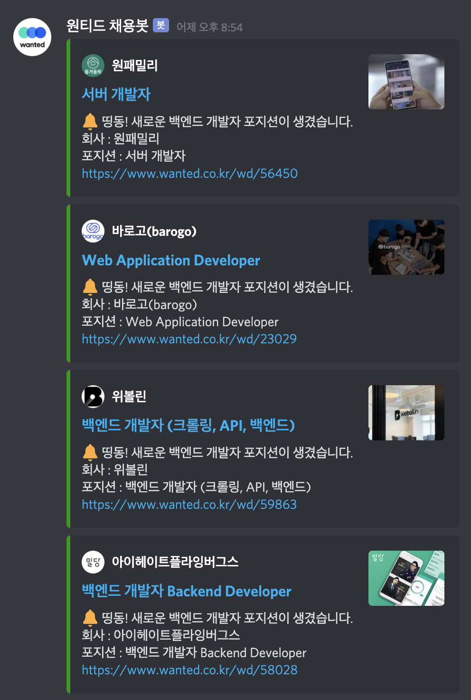

# wanted-sauron For Discord

원티드 각 파트([노드](https://www.wanted.co.kr/wdlist/518/895), [백엔드(자바)](https://www.wanted.co.kr/wdlist/518/872), [프론트엔드](https://www.wanted.co.kr/wdlist/518/669), [iOS](https://www.wanted.co.kr/wdlist/518/678), [안드로이드](https://www.wanted.co.kr/wdlist/518/677), [UX/UI](https://www.wanted.co.kr/wdlist/511/599)) 포지션에서 신규 구인이 생길 때 마다 디스코드 웹훅으로 보내는 봇 입니다.

각 브랜치별로 전체 구인 채널과 파트별 구인 채널에 등록합니다.

powered by Kotlin + Github Actions

